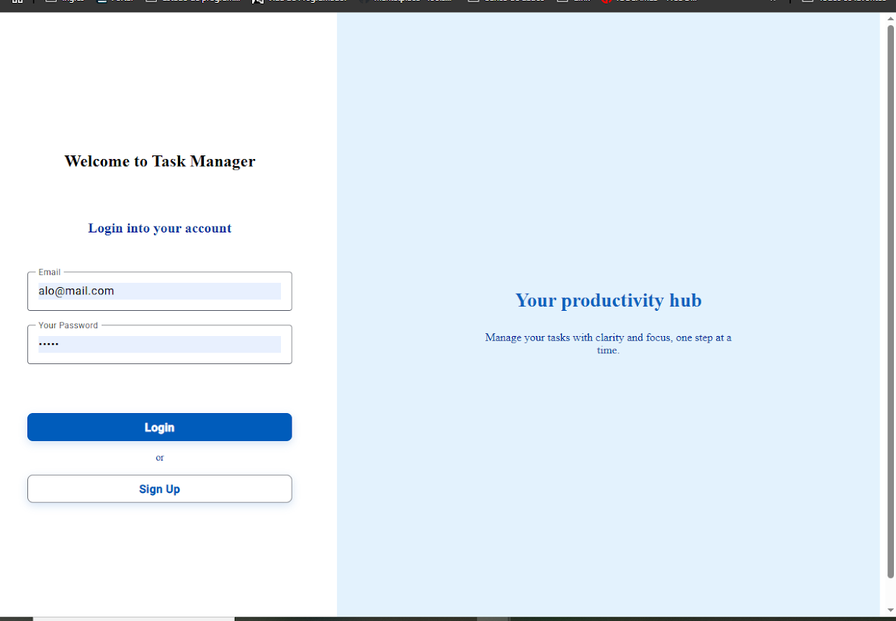
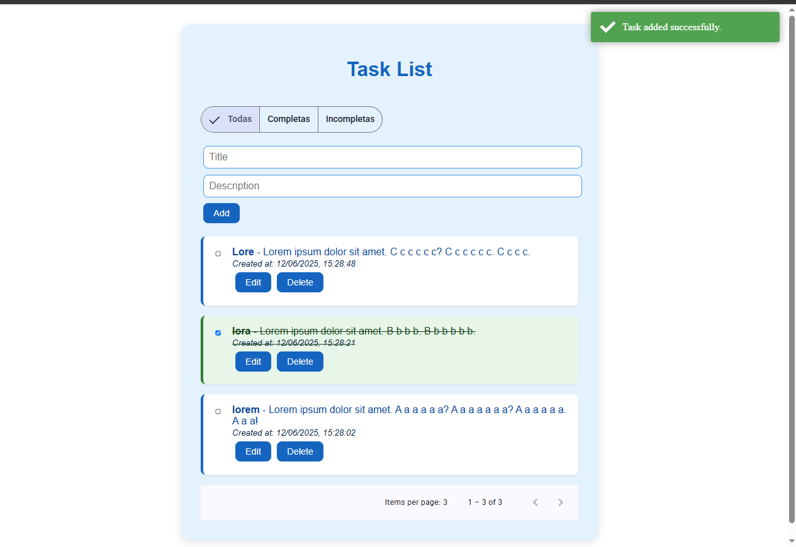

```markdown
# Task Manager

A full-stack task management application built as part of the technical challenge.  
The project provides authentication and CRUD operations for tasks, using Angular for the frontend and Node.js/Express with PostgreSQL for the backend.

## 🧱 Stack

### Backend:
- Node.js ^22
- Express ^5
- TypeScript
- Prisma ^6
- PostgreSQL ^17

### Frontend:
- Angular ^19
- Angular Material ^19
- RxJS
- ngx-toastr

## 🔧 Features

- ✅ JWT-based authentication
- ✅ User registration and login
- ✅ CRUD for tasks (title, description, due date)
- ✅ Pagination and filtering on task list
- ✅ Angular standalone components and reactive forms
- ✅ Global HTTP interceptor for token injection
- ✅ Error handling and loading indicators
- ✅ Fully containerized with Docker Compose

## 🗃️ Project Structure

```

/app
/backend      → Node.js API with Prisma and PostgreSQL
/frontend     → Angular 19 app with Material UI
docker-compose.yml
README.md

````

---

## 🚀 Getting Started

### 1. Clone the repository

```bash
git clone https://github.com/yourusername/tekna-task-manager.git
cd tekna-task-manager
````

### 2. Create your `.env` file

In the `app/backend` folder, copy `.env.example` and configure your environment variables:

```bash
cp app/backend/.env.example app/backend/.env
```

Example content:

```env
DATABASE_URL="postgresql://postgres:postgres@db:5432/tasksdb"
JWT_SECRET="your_jwt_secret"
PORT=3000
```

> **Note:** `db` is the name of the Postgres service from Docker Compose.

---

### 3. Run everything with Docker Compose

```bash
docker-compose up --build
```

This command will:

* Start the PostgreSQL database
* Run backend migrations and seeds
* Serve the Node.js API at `http://localhost:4000`
* Serve the Angular frontend at `http://localhost:4200`
* Serve the Prisma studio at `http://localhost:5555`

---

---

### 4. (Optional) Seed the Database

After building the Docker container, you can populate the database with sample data by running:

```bash
npx prisma generate && node prisma/seed.js
```

This command will:

* Generate the Prisma client
* Insert a test user with pre-defined tasks into the database

#### Sample credentials created:

```
Email:    leandro@example.com  
Password: 123456
```

> 💡 You can use these credentials to log in and explore the application immediately.

---

## 📬 API Endpoints

## 📬 API Endpoints

### Authentication

| Method | Endpoint       | Description           |
| ------ | -------------- | --------------------- |
| POST   | /auth/register | Register a new user   |
| POST   | /auth/login    | Login and receive JWT |

### Tasks (Protected)

| Method | Endpoint    | Description                            |
| ------ | ----------- | -------------------------------------- |
| GET    | /tasks      | List tasks (with filters & pagination) |
| POST   | /tasks      | Create a new task                      |
| PUT    | /tasks/\:id | Update a task                          |
| DELETE | /tasks/\:id | Delete a task                          |

All `/tasks` routes require a valid JWT in the `Authorization` header.

---

## 🖼️ Frontend Overview

### Pages

* **Login / Register**: Authenticate with the backend
* **Task List**: Displays user’s tasks with pagination
* **Create/Edit Task**: Form for managing tasks

### Features

* Angular Reactive Forms
* JWT stored and used via HTTP Interceptor
* User feedback with Angular Material & Toastr
* Reusable paginator component

---

## 📦 Prisma & DB Setup (Auto-run in Docker)

* `npx prisma migrate dev` — runs migrations
* `npx prisma db seed` — seeds default data
* Prisma Client is automatically generated during build

---

## ✅ To Do (Bonus)

* [x] Task filters by title, description, completed
* [x] Pagination
* [ ] Task categories (not implemented)
* [ ] Profile page (not implemented)

---

## 📸 Screenshots



---

## 🤝 Contributing

Pull requests are welcome. For major changes, open an issue first to discuss your idea.

---

## 📝 License

This project is open-source and available under the MIT License.

---

## 👨‍💻 Author

Developed by [Leandro Melgarejo](https://github.com/leandrolm2) as part of the **TTechnical Challenge**.

```